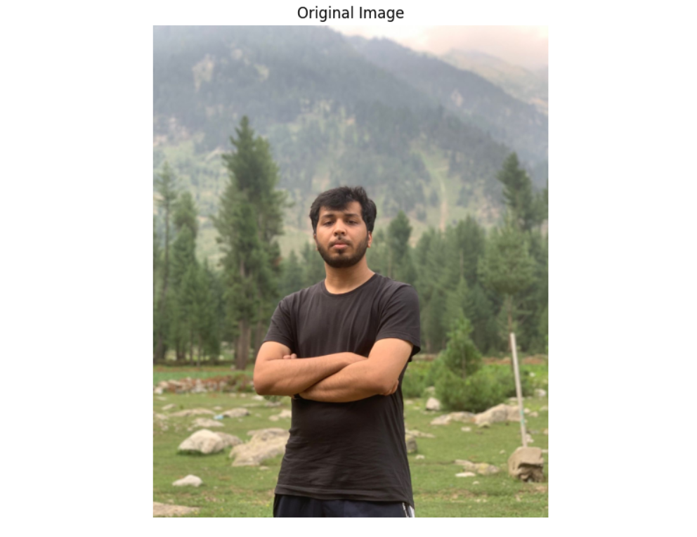
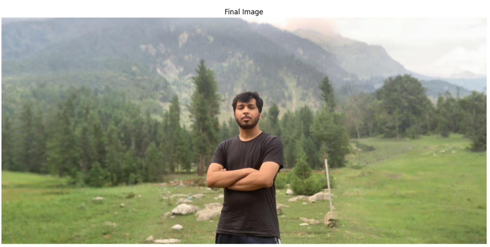

Performed Image Extending using Stable Diffusin Model, you can check results below. For better generation, use prompts to better guide the model about generation.

# Original Image

# Outpainted Image

